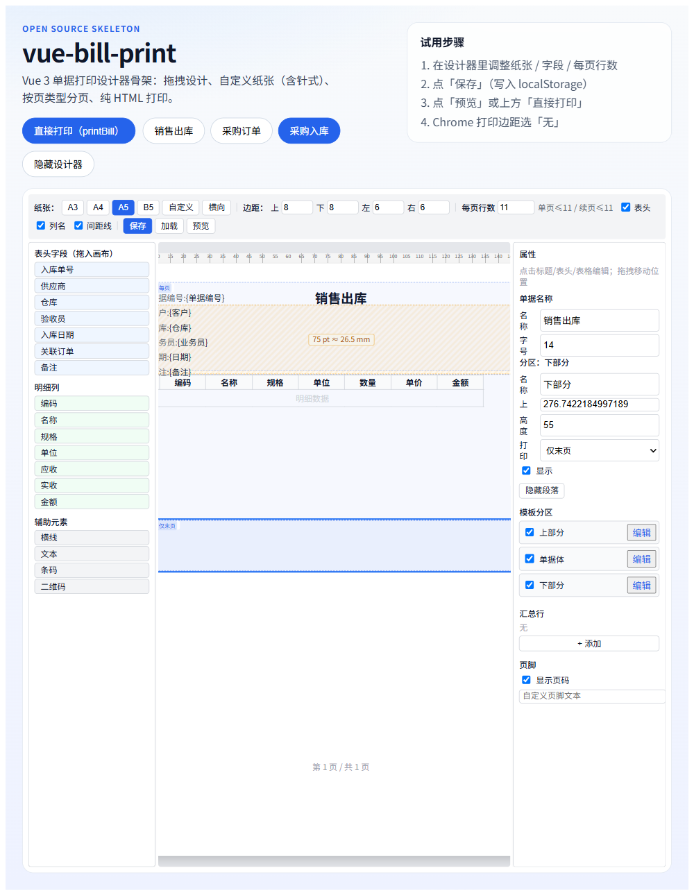
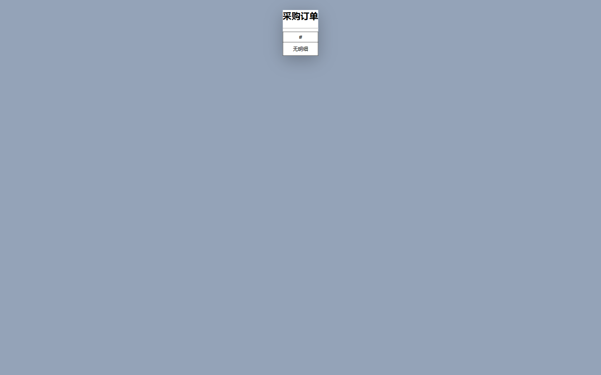

# vue-bill-print

[](https://github.com/1476989162/vue-bill-print/actions/workflows/ci.yml)
[](https://www.npmjs.com/package/vue-bill-print)
[](https://www.npmjs.com/package/vue-bill-print)
[](https://opensource.org/licenses/MIT)

[简体中文](README.md) · English

Vue 3 bill print designer: drag-and-drop template, custom paper (incl. dot-matrix/continuous forms), page-kind-aware pagination, pure HTML print (no hiprint).

> Version `0.1.0`: runnable open-source skeleton. The production rendering engine has been extracted into the library; UI is self-contained (no UnoCSS/Tailwind dependency). Designer CSS, alias fields, and multi-template demos are now complete.

## Demo

| Designer | Preview |
| :---: | :---: |
|  |  |

Open the [online playground](http://localhost:5177) to try live. Switch between Sales Order / Purchase Order / Stock-In with the template switcher.

## Features

- Visual designer: header fields / detail columns / hline / text / barcode / QR
- Custom paper (A3/A4/A5/B5/custom), adjustable margins
- Dot-matrix friendly: `@page { margin: 0 }` + design margin as padding, avoids Chrome "margins: none" scaling glitches
- Page-kind pagination: first / continuation / last with different row capacities; header on first page only; footer sticks to table bottom
- Pluggable template store (localStorage / your API)
- Zero Element Plus runtime dependency (native buttons)
- Self-contained CSS (no UnoCSS/Tailwind required)
- Alias fields (`header`/`details`/`headerMeta`/`detailMeta`) for non-`Tb` payloads

## Quick start (playground)

```bash
pnpm install
pnpm dev
```

Open `http://localhost:5177`:

1. Adjust paper / fields / rows-per-page
2. Click Save
3. Click Preview or Print
4. Chrome print margins: **None**

## Install (after publish)

```bash
pnpm add vue-bill-print
# peer: vue ^3.4
```

```ts
import { configure, createLocalStorageStore, printBill, PrintDesigner } from 'vue-bill-print'

configure({
  store: createLocalStorageStore(),
  onMessage: (level, text) => console.log(level, text),
})

await printBill({
  formType: 'Sales Order',
  data: billData,
})
```

```vue
<template>
  <PrintDesigner form-type="Sales Order" :backend-data="billData" />
</template>
```

### Import styles

```ts
import 'vue-bill-print/style.css'
```

## Connect your backend

Implement `TemplateStore` to wire to any API:

```ts
import { configure, type TemplateStore } from 'vue-bill-print'

const apiStore: TemplateStore = {
  async load(formType) {
    const res = await fetch(`/api/print/template?type=${encodeURIComponent(formType)}`)
    const json = await res.json()
    return json.template ?? null
  },
  async save(formType, templateJson) {
    await fetch('/api/print/template', {
      method: 'POST',
      headers: { 'Content-Type': 'application/json' },
      body: JSON.stringify({ formType, template: templateJson }),
    })
  },
}

configure({ store: apiStore })
```

## Data shape

```ts
interface BackendData {
  Tb?: Record<string, unknown>                 // header values
  TbDetail?: Record<string, unknown>[]         // detail rows
  TbHeaders?: FieldMeta[]                      // header field metadata
  TbDetailHeaders?: FieldMeta[]                // detail column metadata

  // Aliases (optional — auto-normalized into Tb* at render time)
  header?: Record<string, unknown>
  details?: Record<string, unknown>[]
  headerMeta?: FieldMeta[]
  detailMeta?: FieldMeta[]
}
```

Compatible with many Chinese ERP bill payloads (`Tb` / `TbDetail` naming kept for migration ease).

## Project layout

```text
vue-bill-print/
├── src/
│   ├── index.ts            # public exports
│   ├── types.ts            # TemplateStore / PrintTemplateConfig / BackendData
│   ├── storage.ts          # configure() + localStorage store
│   ├── print.ts            # printBill()
│   ├── render.ts           # HTML render + pagination engine
│   ├── format.ts
│   └── PrintDesigner.vue   # visual designer
├── playground/             # Vite demo with template switcher
├── .github/workflows/      # CI / Release
├── docs/screenshots/       # demo screenshots
├── README.md               # 简体中文
├── README.en.md            # English
└── LICENSE                 # MIT
```

## Development

```bash
pnpm install
pnpm run typecheck         # vue-tsc --noEmit
pnpm run build:lib         # vite build + declaration emit
```

## Roadmap

- [x] Core skeleton and rendering engine
- [x] CI automation (typecheck + build)
- [x] Self-contained designer CSS (no UnoCSS/Tailwind)
- [x] `header` / `details` / `headerMeta` / `detailMeta` alias fields
- [x] Multiple demos (Sales / Purchase / Stock-In)
- [x] English documentation
- [ ] First npm publish
- [ ] `v0.1.0` tagged release via CI
- [ ] More built-in templates (quotation, delivery note)
- [ ] Print preview within page (avoid `window.open` popup blocker)

## License

MIT
